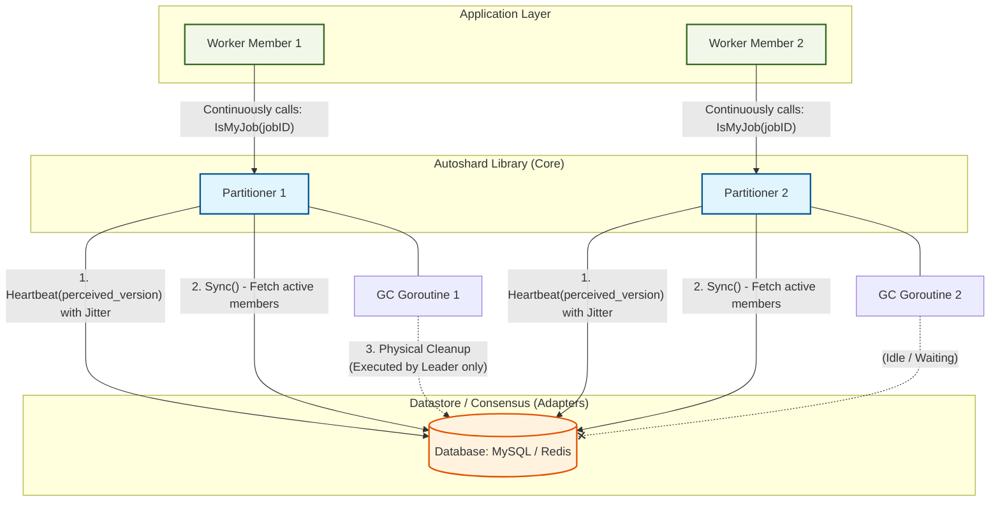

# ⚙️ Autoshard

[](https://golang.org/dl/)
[](https://github.com/phuonguno98/autoshard/actions/workflows/ci.yml)
[](https://pkg.go.dev/github.com/phuonguno98/autoshard)
[](https://goreportcard.com/report/github.com/phuonguno98/autoshard)
[](https://opensource.org/licenses/MIT)

**Autoshard** là một thư viện Golang hiệu năng cao dành cho việc phân chia khối lượng công việc (Workload Partitioning) theo mô hình **Masterless Active-Active**.

Thư viện giúp tự động phân phối các tác vụ chạy ngầm (background jobs), hàng đợi (queues), hoặc các tiến trình định kỳ (cron tasks) cho một cụm các máy chủ (Workers) một cách đồng đều mà không cần đến các bộ điều phối tập trung (như Zookeeper/etcd) hay các Message Broker hạng nặng (như Kafka/RabbitMQ).

Thay vì sử dụng các giao thức P2P/Gossip phức tạp, Autoshard sử dụng cơ chế **Rào chắn Hội tụ Không giao tiếp (Zero-Communication Consensus Barrier)** dựa trên chính cơ sở dữ liệu sẵn có của bạn (MySQL, Redis,...) làm nguồn chân lý duy nhất (Single Source of Truth).

---

## ✨ Tại sao chọn Autoshard?

Khi bạn mở rộng hệ thống từ 1 lên N máy chủ (Pods), bạn sẽ đối mặt với rủi ro **xử lý trùng lặp** (nhiều máy cùng làm một việc) hoặc **tranh chấp tài nguyên**. Autoshard giải quyết vấn đề này một cách tất định (Deterministic) bằng toán học Modulo Hashing.

*   **🚫 Không Master, Không P2P:** Không có khái niệm Master/Slave. Mọi Worker đều bình đẳng. Không cần mở cổng mạng (RPC/TCP) giữa các Worker.
*   **🛡️ Chế độ An toàn Bất đối xứng (Asymmetric Safe Mode):** Trong quá trình mở rộng cụm hoặc khi có máy chủ bị crash, hệ thống ưu tiên tính sẵn sàng cao và triệt tiêu hoàn toàn rủi ro "Split-brain".
*   **🧬 Sức mạnh Generics & SHA-256:** Hỗ trợ phân chia Job theo `string` (UUID), `int`, `uint64`,... Dữ liệu chuỗi được băm bằng thuật toán **SHA-256** để đạt độ dàn trải toán học hoàn hảo. Xử lý tối ưu dải số nguyên âm.
*   **📊 Enterprise Observability:** Cung cấp phương thức `Status()` và các Callback Hooks (`OnSyncError`, `OnStateChange`) tích hợp mượt mà với Prometheus/Grafana.
*   **🌊 Chống nhiễu Đột biến (Anti-Thundering Herd):** Tích hợp sẵn cơ chế **Micro-jitter** giúp bảo vệ Database khỏi tình trạng nghẽn cổ chai khi hàng loạt máy chủ khởi động cùng lúc.
*   **⚡ Hiệu năng Tối ưu:** Áp dụng kỹ thuật **Lock Stripping**, tách biệt việc tính toán băm (CPU-bound) khỏi các Critical Section, đảm bảo thông lượng xử lý cực lớn.

---

## 🏗️ Kiến trúc Tổng thể



---

## 📦 Cài đặt

```bash
go get github.com/phuonguno98/autoshard
go get github.com/phuonguno98/autoshard/adapters/mysql # Hoặc /adapters/redis
```

---

## 🚀 Hướng dẫn nhanh

Tích hợp Autoshard vào dịch vụ Go của bạn chỉ với chưa đầy 20 dòng code:

```go
package main

import (
	"context"
	"database/sql"
	"fmt"
	"time"

	"github.com/phuonguno98/autoshard"
	"github.com/phuonguno98/autoshard/adapters/mysql"
	_ "github.com/go-sql-driver/mysql"
)

func main() {
	ctx, cancel := context.WithCancel(context.Background())
	defer cancel()

	// 1. Sinh định danh duy nhất cho thực thể này (Worker Pod)
	memberID := autoshard.GenerateMemberID("worker")

	// 2. Khởi tạo Storage Adapter (Ví dụ MySQL)
	db, _ := sql.Open("mysql", "user:pass@tcp(localhost:3306)/mydb")
	registry, err := mysql.NewRegistry(db, "autoshard_registry")
	if err != nil {
		log.Fatal(err)
	}

	// 3. Khởi tạo Partitioner với Functional Options (Enterprise defensive return)
	partitioner, err := autoshard.NewPartitioner(memberID, registry,
		autoshard.WithSyncInterval(10*time.Second),
		autoshard.WithActiveWindow(30*time.Second),
	)
	if err != nil {
		log.Fatal(err)
	}

	// 4. Chạy các vòng lặp Sync và Dọn rác (GC) ngầm
	go partitioner.RunSyncLoop(ctx)
	go registry.StartGarbageCollector(ctx, memberID, 1*time.Minute, 5*time.Minute)

	// Giải phóng tài nguyên an toàn (Sử dụng sync.Once nội bộ)
	defer partitioner.Shutdown(ctx)

	// 5. Business Logic: Kiểm tra công việc có thuộc về Worker này không?
	jobIDs := []string{"job-uuid-1", "job-uuid-2", "job-uuid-3"}

	for _, jobID := range jobIDs {
		// IsMyJob sử dụng Generics và SHA-256 để định tuyến công việc tất định
		if autoshard.IsMyJob(partitioner, jobID) {
			fmt.Printf("Worker %s đang xử lý tác vụ: %s<br/>", memberID, jobID)
			// Thực thi công việc tại đây...
		}
	}
}
```

---

## 🔌 Bộ điều hợp lưu trữ (Storage Adapters)

Kiến trúc Lục giác giúp tách lõi logic khỏi tầng lưu trữ. Bạn có thể chọn Adapter phù hợp:

| Adapter | Phù hợp cho | Đặc tính kỹ thuật |
| :--- | :--- | :--- |
| **`adapters/mysql`** | Hệ thống Production | Sử dụng `NOW()` để chống lệch giờ. Bầu chọn Leader động cho dọn rác (GC). |
| **`adapters/redis`** | Hiệu năng cao | Tận dụng cơ chế TTL của Redis. Tự động thu hồi mà không cần vòng lặp dọn rác. |
| **`adapters/memory`** | Local Dev / Unit Test | Sử dụng `sync.RWMutex` map. Không phụ thuộc bên ngoài. |

---

## 🛠️ Cấu hình nâng cao (Options)

Bạn có thể tùy biến hành vi của Partitioner thông qua Options pattern:

```go
partitioner := autoshard.NewPartitioner("node-1", registry,
    autoshard.WithSyncInterval(15 * time.Second), // Tần suất kiểm tra cụm
    autoshard.WithActiveWindow(45 * time.Second), // Thời gian coi một node là "chết"
    autoshard.WithJitterPercent(0.15),            // Thêm 15% delay ngẫu nhiên để bảo vệ DB
    autoshard.WithHasher(myCustomHasher),         // Ghi đè bộ hash mặc định
)
```

---

## 📚 Tài liệu chi tiết

Để hiểu sâu hơn về cơ sở lý thuyết, chứng minh toán học và máy trạng thái rào chắn hội tụ:

*   [Nguyên lý hoạt động & Kiến trúc](docs/ARCHITECTURE.md)
*   [Chi tiết thực thi mã nguồn](docs/IMPLEMENTATION.md)
*   [Hướng dẫn Phát triển (Go Guidelines)](docs/GO_GUIDELINES.md)

---

## 📄 Giấy phép

Dự án được phát hành dưới giấy phép MIT - xem file [LICENSE](LICENSE) để biết chi tiết.
