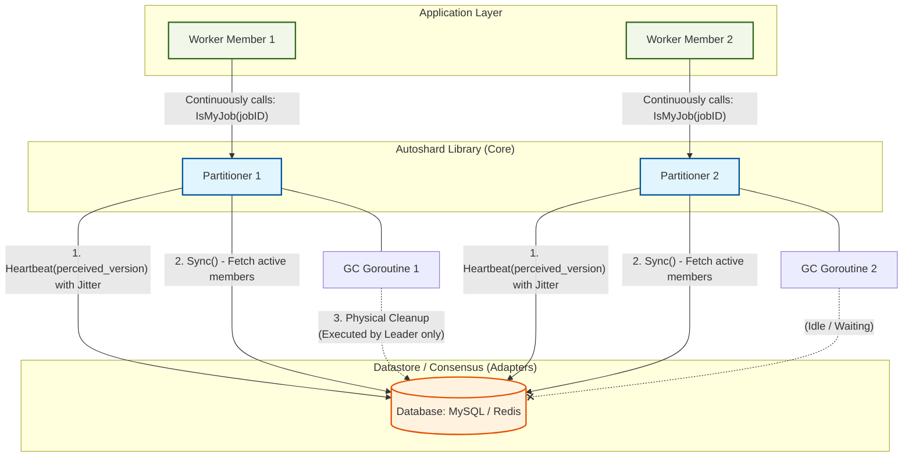
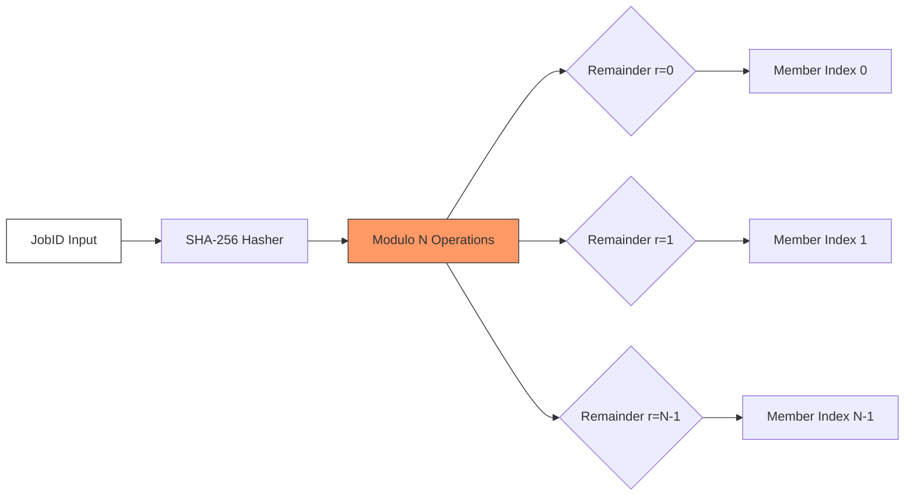
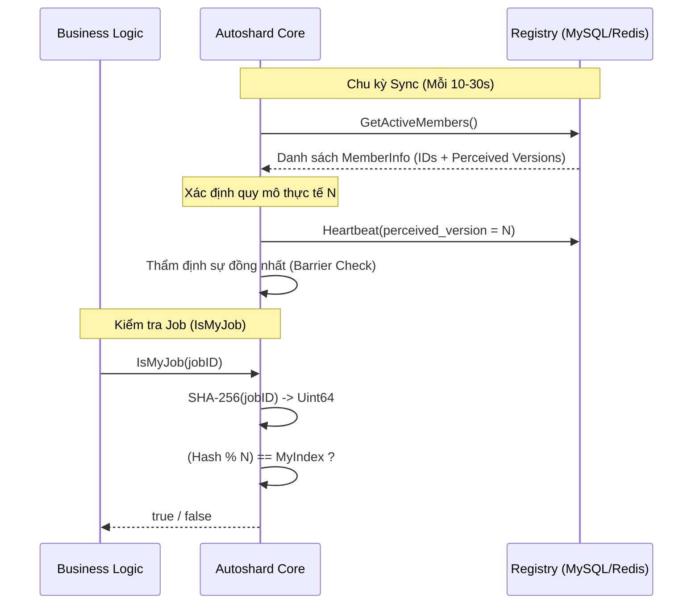

# KIẾN TRÚC HỆ THỐNG: AUTOSHARD

**Phiên bản:** 1.0.0
**Kiến trúc:** Masterless Active-Active, Modulo Hashing, Zero-Communication Consensus
**Cơ chế Đồng thuận:** Database-backed Convergence Barrier (Rào chắn Hội tụ dựa trên CSDL)

---

## 1. TỔNG QUAN HỆ THỐNG (SYSTEM OVERVIEW)

Trong kiến trúc hệ thống phân tán, việc điều phối nhiều Worker cùng xử lý một tập dữ liệu quy mô lớn thường đối mặt với thách thức về tranh chấp tài nguyên. Các giải pháp truyền thống như Message Queue (Kafka) yêu cầu hạ tầng phức tạp, trong khi các giao thức P2P/Gossip dễ dẫn đến trạng thái Split-brain.

**Autoshard** cung cấp giải pháp phân chia khối lượng công việc bằng cách sử dụng các hệ quản trị CSDL (MySQL, Redis) làm thực thể điều phối trung tâm (**Single Source of Truth**). Thư viện thực hiện phân phối tải tự động mà không phát sinh lưu lượng truyền thông nội bộ.

---

## 2. TRIẾT LÝ THIẾT KẾ (DESIGN PHILOSOPHY)

Autoshard được xây dựng dựa trên triết lý **"Masterless Active-Active"**. Khác với các hệ thống phân tán truyền thống dựa trên một nút chủ (Master/Leader) để phân phối việc, Autoshard biến tất cả các Thành viên (Members) thành những thực thể tự nhận thức và tự điều phối.

### Nguyên tắc 3 KHÔNG:
1.  **KHÔNG nút chủ (No Master):** Triệt tiêu điểm yếu chí tử (Single Point of Failure).
2.  **KHÔNG giao tiếp nội bộ (No Inter-node Communication):** Không cần mạng lưới mesh (Gossip/P2P), không cấu hình port mạng giữa các Worker.
3.  **KHÔNG trạng thái tập trung (Stateless Consensus):** Mọi quyết định đều dựa trên dữ liệu tức thời từ Registry (Database/Redis).

---

## 3. NGUYÊN LÝ HOẠT ĐỘNG CỐT LÕI (CORE OPERATING PRINCIPLE)

Nguyên lý của Autoshard dựa trên sức mạnh của **Toán học Modulo Tất định (Deterministic Modulo Hashing)**.

### 3.1. Phân chia công việc bằng Modulo Hashing
Khi một Worker nhận được một `JobID`, nó sẽ thực hiện các bước sau:
1.  **Băm (Hashing):** Chuyển đổi `JobID` (chuỗi hoặc số) thành một số nguyên 64-bit không dấu ($M$) bằng thuật toán **SHA-256**.
2.  **Lấy dư (Modulo):** Thực hiện phép toán $M \pmod N$, trong đó $N$ là tổng số Worker đang hoạt động.
3.  **So khớp (Matching):** Nếu kết quả trùng với **Chỉ mục (Index)** của Worker hiện tại, nó sẽ xử lý Job. Nếu không, nó sẽ bỏ qua.

> **Công thức:** $f(JobID, N) = \text{Hash}(JobID) \pmod N$

### 3.2. Chứng minh toán học (Mathematical Foundation)

Tính đúng đắn của hệ thống được đảm bảo thông qua 2 thuộc tính:

#### A. Tính Bao phủ (Collectively Exhaustive)
*   **Chứng minh:** Theo định lý chia có dư Euclid, đối với mọi số nguyên dương $M$ (JobID đã hash) và số chia $N > 0$, phép toán $M \pmod N$ luôn trả về một số dư $r$ duy nhất thuộc tập hợp $S = \{0, 1, ..., N-1\}$.
*   **Hệ quả:** Mọi JobID đầu vào luôn được ánh xạ tới chính xác một chỉ mục thành viên. Không xảy ra hiện tượng dữ liệu mồ côi (Orphaned Data).

#### B. Tính Độc nhất (Mutually Exclusive)
*   **Chứng minh:** Phép toán Modulo là một hàm tất định (Deterministic Function). Việc sử dụng **SHA-256** đảm bảo hiệu ứng tuyết lở (**Avalanche Effect**) cao, phân phối tải đồng đều và triệt tiêu rác băm (Hash Collision).
*   **Hệ quả:** Triệt tiêu hoàn toàn rủi ro hai thành viên cùng xử lý một tác vụ tại một thời điểm.

### 3.3. Sự nhất quán về Tổng số (N) và Chỉ mục (Index)
Để toán học Modulo hoạt động đúng, mọi Worker trong cụm phải có cùng câu trả lời cho hai câu hỏi:
-   Tổng số Worker ($N$) là bao nhiêu?
-   Chỉ mục ($Index$) của tôi là số mấy trong dãy từ $0 \rightarrow N-1$?

Autoshard giải quyết vấn đề này bằng cách sử dụng **Sắp xếp Từ điển (Lexicographical Sorting)** trên `MemberID`. Mọi Worker đều tải danh sách ID từ Database và tự sắp xếp chúng. Vì thuật toán sắp xếp là tất định, mọi Worker sẽ luôn ra cùng một dãy chỉ mục.

---

## 4. CƠ CHẾ ĐỒNG THUẬN RÀO CHẮN (CONVERGENCE BARRIER)

Làm sao để đảm bảo Worker A và Worker B cùng thấy $N=3$ ở cùng một thời điểm? Autoshard sử dụng cơ chế **Convergence Barrier (Rào chắn Hội tụ)**.

### 4.1. Perceived Version (Phiên bản Nhận thức)
Mỗi Worker định kỳ thực hiện vòng lặp `Sync()`:
1.  Đếm số Worker đang sống trong DB ($N_{actual}$).
2.  Ghi nhãn nhịp tim (Heartbeat) kèm theo con số $N_{actual}$ của mình vào DB (`perceived_version`).
3.  Kiểm tra xem tất cả các Member khác trong DB có đang ghi cùng một giá trị `perceived_version` hay không.

### 4.2. Trạng thái Hội tụ (Stable State)
-   **Hội tụ (Converged):** Khi 100% Member đều ghi nhận cùng một số lượng Worker ($N$). Lúc này, "Rào chắn" mở ra, các Worker bắt đầu nhận Job.
-   **Chưa hội tụ (Unstable):** Khi mới có Worker tham gia hoặc thoát ra, `perceived_version` sẽ bị lệch. Lúc này hệ thống rơi vào trạng thái phòng vệ.

---

## 5. CHỐNG SPLIT-BRAIN (ASYMMETRIC SAFE MODE)

Trong giai đoạn "Chưa hội tụ", Autoshard áp dụng chế độ **Phòng vệ Bất đối xứng** để đảm bảo không Job nào bị bỏ sót và không Job nào bị xử lý trùng.

-   **Worker cũ (Existing Members):** Tiếp tục phục vụ dựa trên thông tin cũ (Stale State). Vì Worker mới chưa tham gia vào toán học Modulo của Worker cũ, nên sẽ không có sự tranh chấp.
-   **Worker mới (New Members):** Tuyệt đối không nhận Job (`IsMyJob` luôn trả về `false`). Họ đứng ở chế độ chờ cho đến khi toàn bộ cụm đồng ý về quy mô mới.

Cơ chế này giúp hệ thống mở rộng (Scaling Up/Down) một cách mượt mà mà không cần dừng dịch vụ.

---

## 6. LUỒNG DỮ LIỆU TỔNG QUÁT (DATA FLOW)

---

## 7. LỢI THẾ DOANH NGHIỆP (ENTERPRISE ADVANTAGES)

1.  **Chống hiện tượng Thundering Herd:** Cơ chế Jitter ngẫu nhiên giúp dàn trải các truy vấn Database, tránh gây nghẽn cổ chai khi khởi động hàng nghìn Containers cùng lúc.
2.  **Khả năng tự phục hồi (Zero-Ops):** Nếu một Worker bị treo, sau chu kỳ `ActiveWindow` (mặc định 30s), các Worker còn lại sẽ tự động loại bỏ nó và tái cấu hình lại cụm (Auto-rebalancing).
3.  **Observability:** Tích hợp sâu với Prometheus thông qua các callback hooks, cho phép giám sát trạng thái hội tụ của toàn cụm theo thời gian thực.
