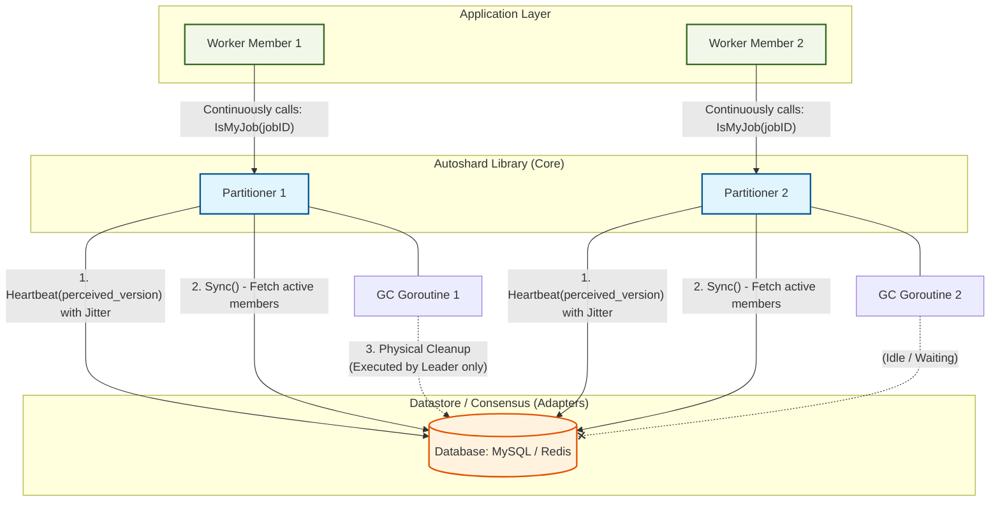
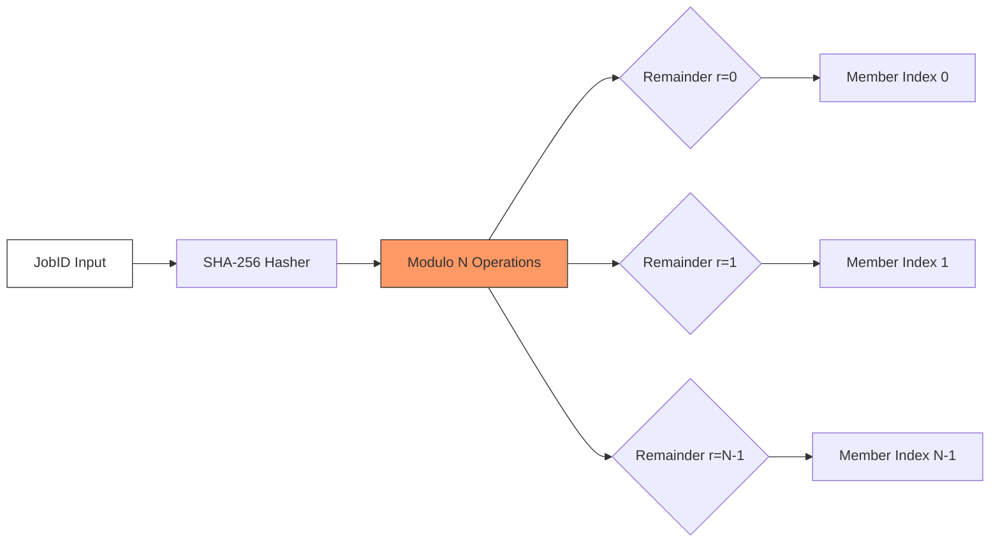
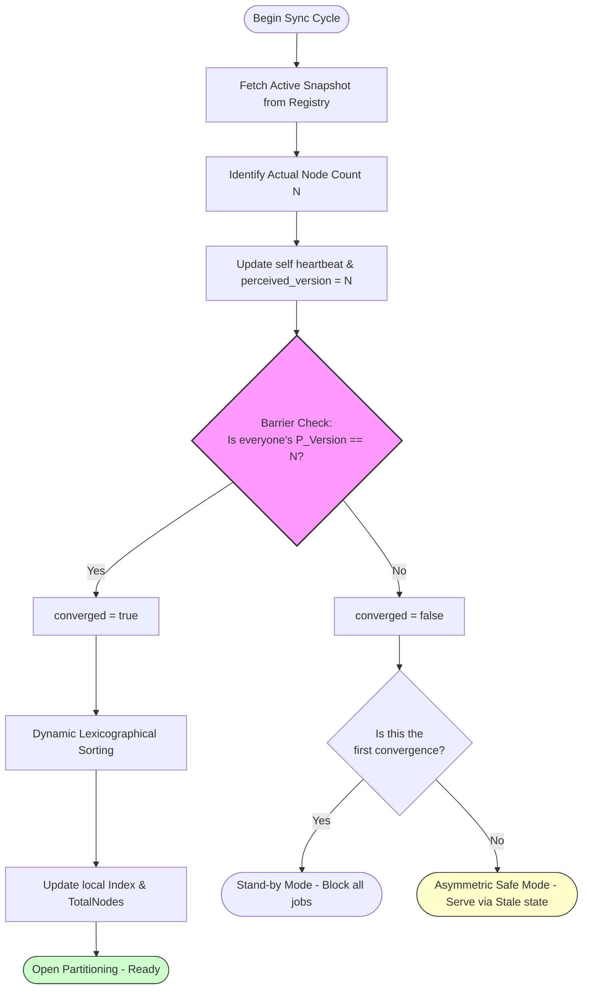

# ĐẶC TẢ THIẾT KẾ VÀ KIẾN TRÚC KỸ THUẬT: AUTOSHARD

**Phiên bản:** 1.0.0
**Kiến trúc:** Masterless Active-Active, Modulo Hashing, Zero-Communication Consensus
**Cơ chế Đồng thuận:** Database-backed Convergence Barrier (Rào chắn Hội tụ dựa trên CSDL)

---

## 1. TỔNG QUAN HỆ THỐNG (SYSTEM OVERVIEW)

Trong kiến trúc hệ thống phân tán (Distributed Systems), việc điều phối nhiều thành viên (Members/Workers) cùng xử lý một tập hợp dữ liệu quy mô lớn thường đối mặt với thách thức về **Tranh chấp tài nguyên (Resource Contention)** và rủi ro **Xử lý dư thừa (Redundant Processing)**. Các giải pháp truyền thống như Message Queue (Kafka, RabbitMQ) yêu cầu hạ tầng vận hành phức tạp, trong khi các giao thức P2P/Gossip (như Hashicorp Memberlist) dễ dẫn đến trạng thái **Split-brain** khi xảy ra phân mảnh mạng (Network Partitioning).

**Autoshard** cung cấp giải pháp phân chia khối lượng công việc (Workload Partitioning) bằng cách sử dụng các hệ quản trị cơ sở dữ liệu (MySQL, PostgreSQL, Redis) làm thực thể điều phối trung tâm (Single Source of Truth). Thư viện thực hiện phân phối tải tự động giữa các thành viên đang hoạt động (Active Members) mà không phát sinh lưu lượng truyền thông nội bộ (Inter-node Communication), tối ưu hóa băng thông mạng và giảm thiểu độ trễ điều phối.



### Các thuộc tính kỹ thuật cốt lõi:
1.  **Khả năng Tự điều phối (Self-orchestrated):** Tự động phát hiện thành viên (Auto-discovery), tái cân bằng tải động (Dynamic Rebalancing), và thu hồi tài nguyên (Garbage Collection).
2.  **Kiến trúc Phi tập trung (Masterless):** Loại bỏ điểm yếu chí tử (Single Point of Failure). Toàn bộ Member có vai trò ngang hàng, không phụ thuộc vào trạng thái của Controller hay Orchestrator.
3.  **Khả năng Mở rộng (Scalability):** Tích hợp Generics để hỗ trợ đa dạng định dạng `JobID` và cơ chế Adapter linh hoạt cho các loại hình lưu trữ dữ liệu khác nhau.

---

## 2. CƠ SỞ LÝ THUYẾT VÀ TOÁN HỌC (THEORETICAL FOUNDATION)

Mô hình vận hành của Autoshard dựa trên sự kết hợp giữa thuật toán **Modulo Hashing** và cơ chế **Database-backed Heartbeat**. Tính đúng đắn của hệ thống được chứng minh qua các thuộc tính sau:

### 2.1. Tính Bao phủ (Collectively Exhaustive)
*   **Chứng minh:** Theo định lý chia có dư Euclid, đối với mọi số nguyên dương $M$ (JobID đã hash) và số chia $N > 0$ (Tổng số thành viên đang hoạt động), phép toán $M \pmod N$ luôn trả về một số dư $r$ duy nhất thuộc tập hợp $S = \{0, 1, ..., N-1\}$.
*   **Hệ quả:** Mọi JobID đầu vào luôn được ánh xạ tới chính xác một chỉ mục thành viên (Member Index). Không xảy ra hiện tượng dữ liệu mồ côi (Orphaned Data).



### 2.2. Tính Độc nhất (Mutually Exclusive)
*   **Chứng minh:** Phép toán Modulo là một hàm tất định (Deterministic Function). Với cùng một cặp tham số $(M, N)$, kết quả $r$ luôn không đổi. Đối với dữ liệu dạng chuỗi (String), Autoshard áp dụng thuật toán **SHA-256** (trích xuất 64-bit đầu tiên) để chuyển đổi sang số nguyên $M$. Việc sử dụng SHA-256 đảm bảo hiệu ứng tuyết lở (**Avalanche Effect**) cao, phân phối tải đồng đều và giảm thiểu xác suất xung đột (Hash Collision).
*   **Hệ quả:** Triệt tiêu hoàn toàn rủi ro hai thành viên cùng xử lý một tác vụ tại một thời điểm nhất định.

---

## 3. CƠ CHẾ ĐỒNG THUẬN VÀ XỬ LÝ "KHOẢNG THỜI GIAN NHẤT QUÁN"

Trong mô hình Zero-Communication, rủi ro lớn nhất là khoảng thời gian không nhất quán (Inconsistency Window) khi cấu hình cụm (Topology) thay đổi. Autoshard giải quyết vấn đề này thông qua cơ chế **Rào chắn Hội tụ (Convergence Barrier)**.

### 3.1. Rào chắn Hội tụ (Convergence Barrier)
Thư viện cung cấp khả năng tự nhận thức trạng thái cụm (Cluster Self-awareness) thông qua tầng dữ liệu:
*   Mỗi thành viên duy trì một thuộc tính `perceived_version` (Phiên bản nhận thức về quy mô cụm).
*   Trong chu kỳ `Sync()`, thành viên thực hiện truy vấn số lượng thực thể đang hoạt động thực tế ($N_{actual}$) và kiểm tra tính đồng lạc của toàn bộ các thành viên khác.
*   Trạng thái hệ thống chỉ được xác nhận là **Hội tụ (Stable)** khi và chỉ khi 100% thành viên ghi nhận cùng một giá trị $N_{actual}$. Mọi sự sai lệch về nhận thức sẽ buộc hệ thống tạm thời rơi vào trạng thái phòng vệ.

### 3.2. Chế độ An toàn Bất đối xứng (Asymmetric Safe Mode)
Khi phát hiện trạng thái chưa hội tụ (Unstable), hệ thống kích hoạt cơ chế phòng vệ ưu tiên **Tính sẵn sàng (Availability)**:
*   **Thành viên hiện hữu (Existing Members):** Tiếp tục duy trì xử lý dựa trên trạng thái nhất quán gần nhất (Stale State) để đảm bảo dòng chảy công việc không bị gián đoạn.
*   **Thành viên mới (New Members):** Trạng thái `IsMyJob()` sẽ mặc định trả về `false`. Thành viên này sẽ ở chế độ chờ (Stand-by) cho đến khi rào chắn hội tụ được thiết lập hoàn toàn.

### 3.3. Sắp xếp Động (Dynamic Lexicographical Sorting)
Chỉ mục (Index) của thành viên được tính toán động dựa trên thứ tự từ điển (Lexicographical Order) của `MemberID`. Cơ chế này đảm bảo tính liên tục của dãy chỉ mục $0 \rightarrow N-1$ ngay cả khi có sự thay đổi bất ngờ về số lượng thành viên, mà không cần lưu trữ chỉ mục cứng trong cơ sở dữ liệu.

---

## 4. CƠ CHẾ BẢO VỆ VÀ TỐI ƯU HIỆU NĂNG

*   **Xóa Logic (Logical Deletion):** Truy vấn danh sách thành viên sử dụng điều kiện lọc thời gian thực (`WHERE last_heartbeat >= NOW() - INTERVAL 30 SECOND`). Cơ chế này cho phép loại bỏ các thành viên gặp sự cố khỏi tập hợp hoạt động chỉ trong vài giây.
*   **Micro-Jitter:** Các chu kỳ thực thi (`Heartbeat`, `Sync`) tích hợp độ trễ ngẫu nhiên (10% - 20%). Kỹ thuật này triệt tiêu hiện tượng **Thundering Herd**, bảo vệ tài nguyên Database (Connection Pool, I/O) khỏi các đỉnh tải đột biến khi triển khai số lượng lớn Pods/Containers đồng thời.
*   **Enterprise Safety & Observability:**
    *   **High Entropy**: `GenerateMemberID` sử dụng 8 bytes (16 hex chars) ngẫu nhiên để triệt tiêu va chạm ID trong cụm siêu lớn.
    *   **Defensive API**: Toàn bộ Constructor trả về `error` và thực hiện validate đầu vào (ví dụ: Regex guard cho SQL table name).
    *   **Observability Hooks**: Cung cấp `OnSyncError` và `OnStateChange` để tích hợp hạ tầng giám sát.
*   **Giải phóng Tài nguyên An toàn (Graceful Deregistration):** Khi nhận tín hiệu dừng từ hệ điều hành (SIGTERM/SIGINT), thư viện thực hiện xóa định danh bản thân khỏi Registry, sử dụng `sync.Once` để bảo vệ và `context.WithTimeout(5s)` để đảm bảo tiến trình thoát không bị treo.

---

## 5. KIẾN TRÚC THỰC THI (IMPLEMENTATION ARCHITECTURE)

Dự án áp dụng chặt chẽ **Kiến trúc Lục giác (Hexagonal Architecture)**.

### 5.1. Định nghĩa Interface (The Technical Contract)
Tầng Core chỉ phụ thuộc vào các định nghĩa trừu tượng thông qua interface `Registry`:

```go
// Registry defines the contract for cluster membership and heartbeat.
type Registry interface {
	Heartbeat(ctx context.Context, memberID string, perceivedVersion int) error
	GetActiveMembers(ctx context.Context, activeWindow time.Duration) ([]MemberInfo, error)
	Deregister(ctx context.Context, memberID string) error
	StartGarbageCollector(ctx context.Context, memberID string, checkInterval, deadThreshold time.Duration) error
}
```

### 5.2. Máy Trạng thái Đồng bộ (Sync State Machine)
Quy trình thực thi của hàm `Sync()`:
1.  Truy vấn Snapshot thành viên hiện hành từ Registry.
2.  Xác định số lượng thực thể hoạt động ($N_{actual}$).
3.  Cập nhật nhịp tim và phiên bản nhận thức (`perceived_version`) của chính mình.
4.  Thẩm định Rào chắn Hội tụ: So sánh `perceived_version` của tất cả thành viên trong Snapshot với $N_{actual}$.
5.  Cập nhật trạng thái nội tại (Mem-State):
    *   Hội tụ: Tái lập chỉ mục, cập nhật tổng số thành viên, cho phép xử lý.
    *   Không hội tụ: Duy trì trạng thái cũ (đối với thành viên hiện hữu) hoặc Stand-by (đối với thành viên mới).



---

## 6. MÔ HÌNH TRIỂN KHAI (DEPLOYMENT MODEL)

Việc tích hợp thư viện tuân thủ **Functional Options Pattern** nhằm đảm bảo tính linh hoạt:

```go
func main() {
    // 1. Khởi tạo định danh duy nhất (Unique Member ID)
    memberID := autoshard.GenerateMemberID("app-worker")
    
    // 2. Tích hợp MySQL Registry Adapter (Enterprise Defensive Mode)
    registry, err := mysql.NewRegistry(db, "autoshard_workers")
    if err != nil {
        log.Fatal(err)
    }
    
    // 3. Khởi tạo Partitioner với cấu hình Jitter và Window
    partitioner, err := autoshard.NewPartitioner(memberID, registry,
        autoshard.WithSyncInterval(10*time.Second),
        autoshard.WithActiveWindow(30*time.Second),
    )
    if err != nil {
        log.Fatal(err)
    }

    // 4. Kích hoạt chu kỳ đồng bộ và dọn rác zombie
    go partitioner.RunSyncLoop(ctx)
    go registry.StartGarbageCollector(ctx, memberID, 1*time.Minute, 5*time.Minute)
    
    // 5. Giải phóng tài nguyên khi Shutdown
    defer partitioner.Shutdown(ctx)

    // Duy trì vòng lặp xử lý nghiệp vụ
    for {
        jobID := fetchNextJob()
        if autoshard.IsMyJob(partitioner, jobID) {
            processJob(jobID)
        }
    }
}
```