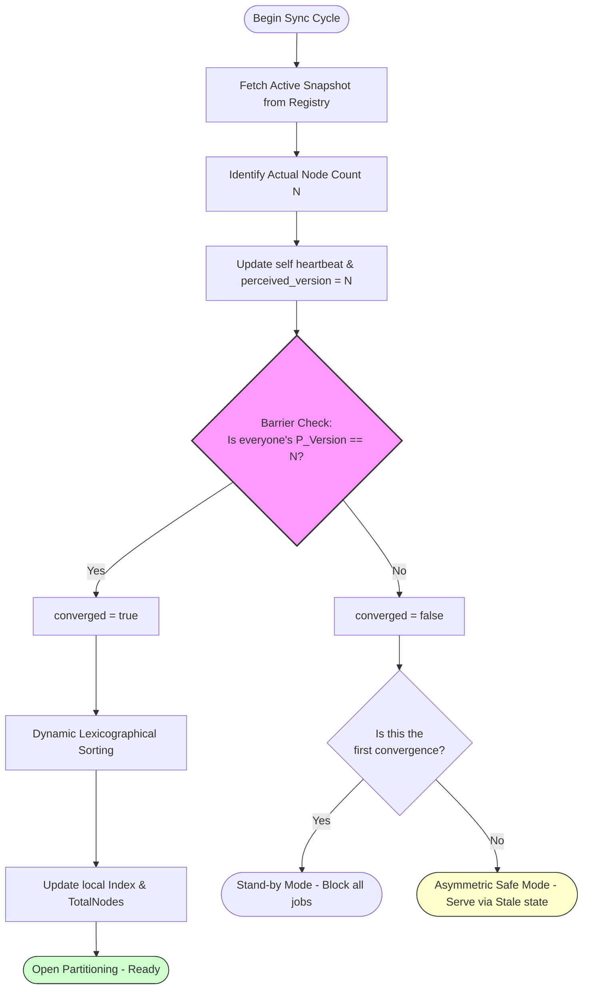

# CHI TIẾT THỰC THI (IMPLEMENTATION DETAILS)

**Phiên bản:** 1.0.0
**Kiến trúc:** Masterless Active-Active, Modulo Hashing, Zero-Communication Consensus
**Cơ chế Đồng thuận:** Database-backed Convergence Barrier (Rào chắn Hội tụ dựa trên CSDL)

Tài liệu này đi sâu vào chi tiết kỹ thuật của các module cốt lõi trong Autoshard.

---

## 1. CẤU TRÚC DỮ LIỆU CỐT LÕI (PARTITIONER STRUCT)

`Partitioner` được thiết kế để đảm bảo an toàn luồng (Thread-safety) và hiệu năng cao.

```go
type Partitioner struct {
	memberID     string
	registry     Registry
	opts         *Options

	mu           sync.RWMutex // Bảo vệ vùng dữ liệu RAM bên dưới
	myIndex      int          // Chỉ mục hiện tại (0 -> N-1)
	totalMembers int          // Tổng số thành viên ghi nhận tại thời điểm hội tụ
	isConverged  bool         // Trạng thái hội tụ của Barrier
	shutdownOnce sync.Once    // Đảm bảo chỉ Deregister một lần
}
```

---

## 2. LOGIC ĐỒNG BỘ HÓA (SYNC WORKFLOW)

Hàm `Sync()` là trái tim của máy trạng thái (State Machine). Nó thực thi theo quy trình 5 bước:

1.  **Fetch**: Tải danh sách `MemberInfo` từ Registry.
2.  **Pulse**: Gửi Heartbeat kèm theo số lượng Member vừa đếm được.
3.  **Validate**: Duyệt qua danh sách, nếu phát hiện bất kỳ Member nào có `perceived_version` khác với số lượng thực tế, đánh dấu `converged = false`.
4.  **Sort**: Nếu `converged`, thực hiện sắp xếp ID (Lexicographical) và gán `myIndex`.
5.  **Notify**: Kích hoạt `OnStateChange` hook ngoài vùng khóa (outside lock) để tránh deadlock/latency cho caller.



---

## 3. TỐI ƯU HÓA ISMYJOB (ZERO-ALLOCATION)

Để đạt được thông lượng hàng triệu TPS, hàm `IsMyJob` áp dụng các kỹ thuật sau:

### 3.1. Lock Stripping
Chúng ta chỉ giữ `RLock()` để đọc `totalMembers` và `myIndex`. Việc tính toán Hash (SHA-256) — vốn ngốn CPU — được thực hiện **sau khi đã nhả khóa**. Việc này giúp giảm thiểu sự tắc nghẽn (Contention) trên Mutex.

### 3.2. Two's Complement cho Số nguyên âm
Đối với các kiểu số (`int`, `int32`, `int64`), Autoshard không sử dụng `fmt.Sprintf` (gây cấp phát vùng nhớ trên Heap). Thay vào đó, chúng ta ép kiểu (cast) trực tiếp về `uint64`.
-   Theo nguyên lý Bù 2 (Two's complement), các số nguyên âm sẽ trở thành những số dương cực lớn (e.g., `-1` trở thành `^uint64(0)`).
-   Về mặt xác suất toán học, các số này vẫn phân bổ đều khi thực hiện phép chia lấy dư (Modulo).

---

## 4. CHI TIẾT ADAPTER (STORAGE ADAPTERS)

### 4.1. MySQL Registry
Sử dụng câu lệnh SQL đặc thù để đảm bảo tính nhất quán:
-   **Heartbeat**: `INSERT ... ON DUPLICATE KEY UPDATE` kèm `NOW()`.
-   **Leader GC**: Sử dụng truy vấn Order By để chọn ra Member có Heartbeat mới nhất làm Leader thực hiện dọn dẹp các Member đã chết quá lâu. Việc này ngăn chặn sự tranh chấp khi nhiều Pod cùng dọn dẹp một lúc.

### 4.2. Redis Registry
-   **Tối ưu TTL**: Sử dụng `SETEX` để lưu Member. Redis tự động xóa Key khi hết hạn.
-   **SCAN vs KEYS**: Sử dụng `SCAN` để duyệt Member mà không làm nghẽn Event Loop của Redis.
-   **Cluster Support**: Registry nhận vào interface `redis.Cmdable`, hỗ trợ cả Redis đơn, Sentinel và Cluster.

---

## 5. QUY TRÌNH SHUTDOWN (GRACEFUL EXIT)

Khi `Shutdown()` được gọi:
1.  Sử dụng `sync.Once` để ngăn chặn việc gửi yêu cầu `Deregister` nhiều lần.
2.  Gửi yêu cầu xóa Member ID khỏi Registry ngay lập tức.
3.  Việc này kích hoạt rào chắn hội tụ của các Member còn lại ngay lập tức (Fast Rebalancing), thay vì phải đợi 30s để nhịp tim hết hạn.
